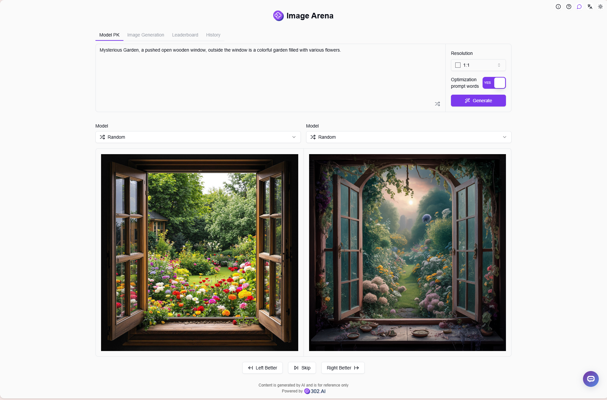
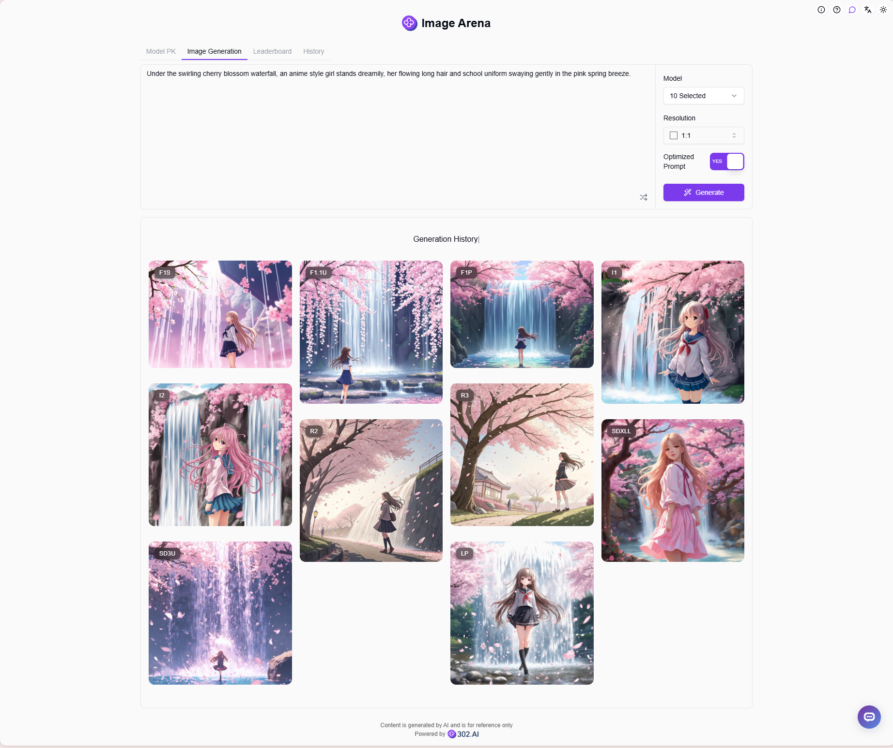
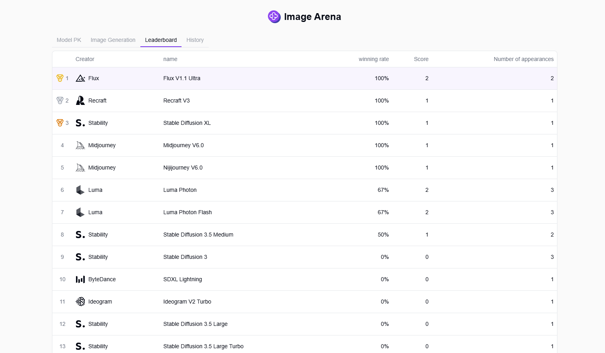
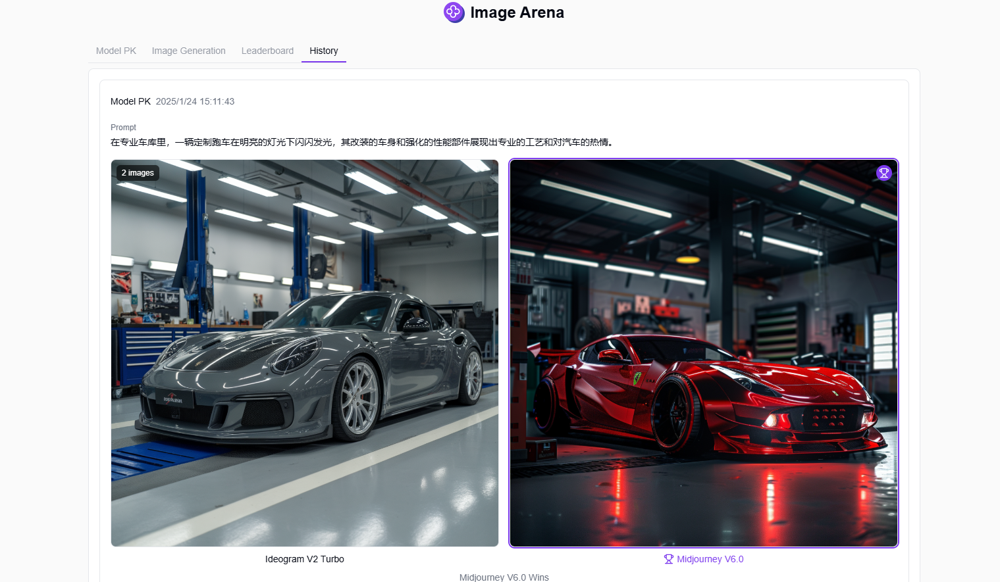

# 
 🎨 Image Arena 🚀✨

Image Arena allows you to generate AI images by randomly or manually selecting two AI models, vote for the model with better results, create personal rankings based on voting results, and generate multiple images simultaneously using multiple AI models.

<a href="README_zh.md">中文</a> | <a href="README.md">English</a> | <a href="README_ja.md">日本語</a>

This is the open-source version of the [Image Arena](https://302.ai/en/tools/imgarena/) from [302.AI](https://302.ai/en/). You can directly log in to 302.AI to use the online version with zero code and zero background, or modify and deploy it yourself according to your requirements.

## Interface Preview
In model battles, you can randomly or manually select two models for text-to-image generation and vote for the model with better results.

Supports generating images with multiple models simultaneously. You can select multiple different models at once, using the same prompts to generate images, quickly comparing the effects of different models.

Based on user voting results, the system automatically generates personal model rankings to help you find the most suitable AI image generation model.

All generated images can be found in the history records.

## Project Features
### 🎨 Multiple Model Support
Supports multiple mainstream AI image generation models, including Stable Diffusion, Midjourney, and more.
### 🔄 Model Comparison
Supports one-on-one comparison or simultaneous generation with multiple models for intuitive effect comparison.
### 📊 Ranking System
Generates personal model rankings based on user votes.
### 💾 History Records
Complete preservation of all generation records and parameter configurations.
### 🌍 Multi-language Support
- Chinese Interface
- English Interface
- Japanese Interface

## 🚩 Future Update Plans
- [ ] Support for more AI image generation models
- [ ] Add more image generation parameter options

## 🛠️ Tech Stack
- React
- Tailwind CSS
- Shadcn UI

## Development & Deployment
1. Clone project `git clone https://github.com/302ai/302_image_arena`
2. Install dependencies `npm`
3. Configure 302's API KEY (refer to .env.example)
4. Run project `npm run dev`
5. Build and deploy `docker build -t 302_image_arena . && docker run -p 3000:80 302_image_arena`
6. Node version 20 or above required

## ✨ About 302.AI ✨
[302.AI](https://302.ai/en/) is an enterprise-oriented AI application platform that offers pay-as-you-go services, ready-to-use solutions, and an open-source ecosystem.✨
1. 🧠 Comprehensive AI capabilities: Incorporates the latest in language, image, audio, and video models from leading AI brands.
2. 🚀 Advanced application development: We build genuine AI products, not just simple chatbots.
3. 💰 No monthly fees: All features are pay-per-use, fully accessible, ensuring low entry barriers with high potential.
4. 🛠 Powerful admin dashboard: Designed for teams and SMEs - managed by one, used by many.
5. 🔗 API access for all AI features: All tools are open-source and customizable (in progress).
6. 💡 Powerful development team: Launching 2-3 new applications weekly with daily product updates. Interested developers are welcome to contact us.
