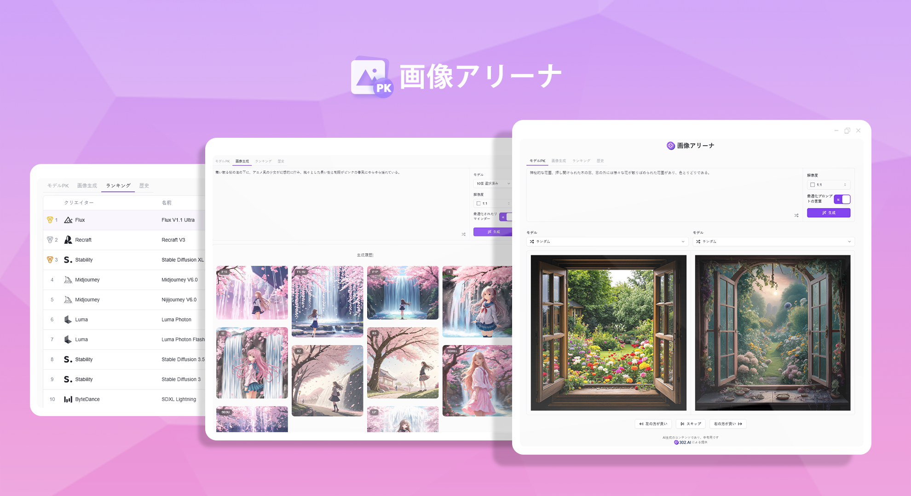
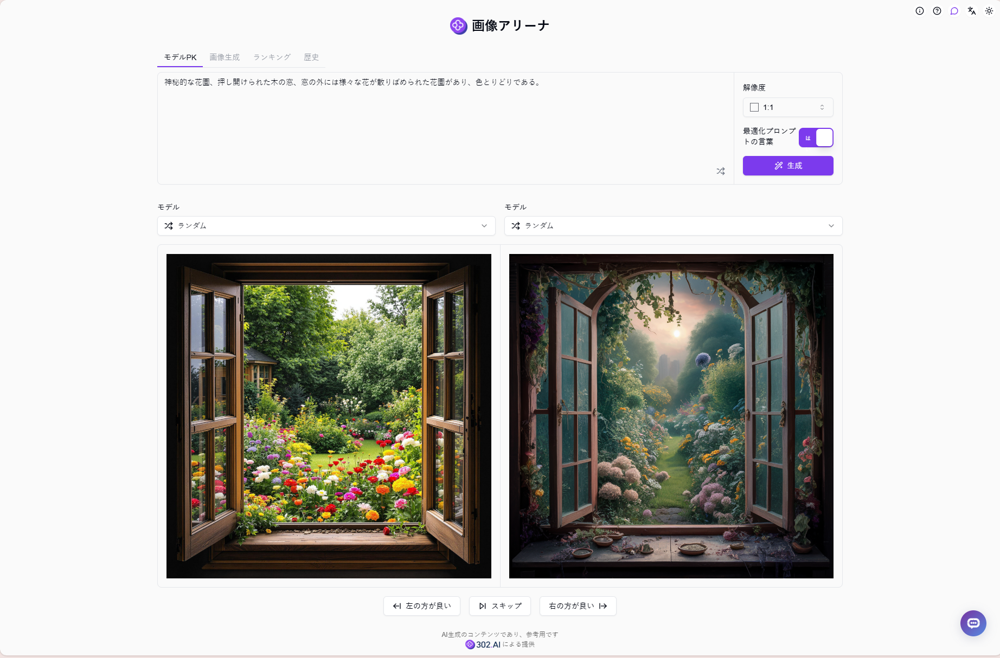
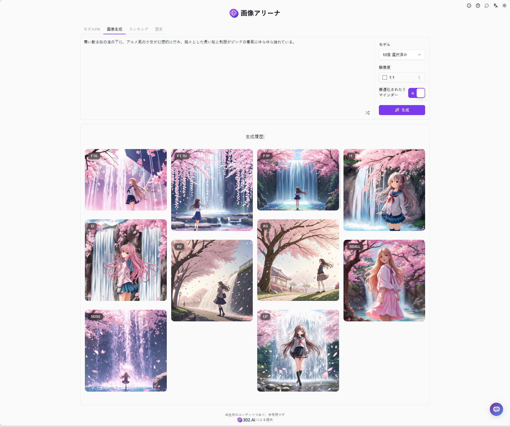
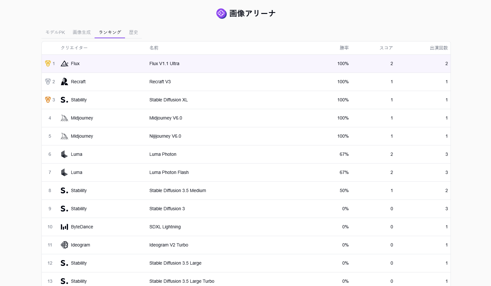
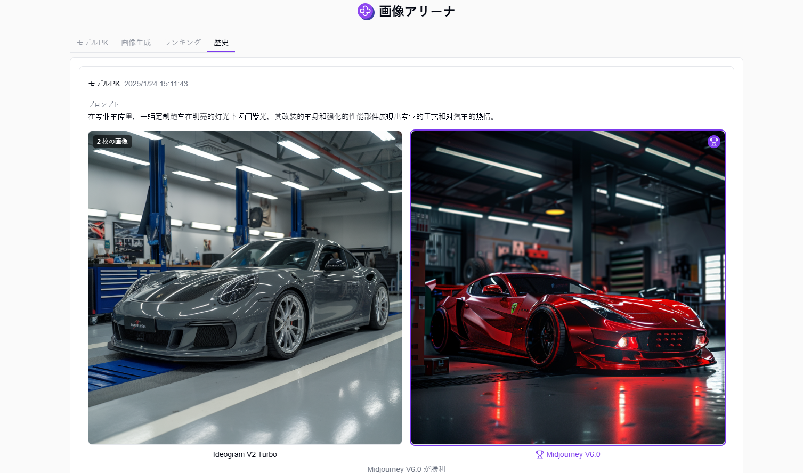

# 
 🎨 画像アリーナ 🚀✨

画像アリーナでは、ランダムまたは手動で2つのAIモデルを選択して画像を生成し、より良い結果のモデルに投票し、投票結果に基づいて個人ランキングを作成し、複数のAIモデルを使用して同時に複数の画像を生成することができます。

<a href="README_zh.md">中文</a> | <a href="README.md">English</a> | <a href="README_ja.md">日本語</a>

[302.AI](https://302.ai/ja/)の[画像アリーナ](https://302.ai/product/detail/57)のオープンソース版です。
302.AIに直接ログインすることで、コード不要、設定不要のオンライン体験が可能です。
あるいは、このプロジェクトをニーズに合わせてカスタマイズし、302.AIのAPI KEYを統合して、自身でデプロイすることもできます。

## インターフェースプレビュー
モデル対決では、ランダムまたは手動で2つのモデルを選択して画像を生成し、より良い結果のモデルに投票することができます。

複数のモデルを同時に選択して画像生成をサポートしています。同じプロンプトを使用して複数の異なるモデルを一度に選択し、画像を生成して、異なるモデルの効果を素早く比較できます。

ユーザーの投票結果に基づいて、システムは自動的に個人モデルランキングを生成し、最適なAI画像生成モデルを見つけるのに役立ちます。

生成されたすべての画像は履歴で確認できます。

## プロジェクトの特徴
### 🎨 マルチモデルサポート
Stable DiffusionやMidjourneyなど、主要なAI画像生成モデルを多数サポート。
### 🔄 モデル比較
1対1の比較や複数モデルの同時生成をサポートし、直感的な効果比較が可能。
### 📊 ランキングシステム
ユーザーの投票に基づいて個人モデルランキングを生成。
### 💾 履歴記録
すべての生成記録とパラメータ設定を完全に保存。
### 🌍 多言語サポート
- 中国語インターフェース
- 英語インターフェース
- 日本語インターフェース

## 🚩 将来のアップデート計画
- [ ] より多くのAI画像生成モデルのサポート
- [ ] より多くの画像生成パラメータオプションの追加

## 🛠️ 技術スタック
- React
- Tailwind CSS
- Shadcn UI

## 開発とデプロイ
1. プロジェクトのクローン `git clone https://github.com/302ai/302_image_arena`
2. 依存関係のインストール `npm`
3. 302のAPI KEYを設定 (.env.exampleを参照)
4. プロジェクトの実行 `npm run dev`
5. ビルドとデプロイ `docker build -t 302_image_arena . && docker run -p 3000:80 302_image_arena`
6. Node バージョン20以上が必要

## ✨ 302.AIについて ✨
[302.AI](https://302.ai/ja/)は企業向けのAIアプリケーションプラットフォームであり、必要に応じて支払い、すぐに使用できるオープンソースのエコシステムです。✨
1. 🧠 包括的なAI機能：主要AIブランドの最新の言語、画像、音声、ビデオモデルを統合。
2. 🚀 高度なアプリケーション開発：単なるシンプルなチャットボットではなく、本格的なAI製品を構築。
3. 💰 月額料金なし：すべての機能が従量制で、完全にアクセス可能。低い参入障壁と高い可能性を確保。
4. 🛠 強力な管理ダッシュボード：チームやSME向けに設計 - 一人で管理し、多くの人が使用可能。
5. 🔗 すべてのAI機能へのAPIアクセス：すべてのツールはオープンソースでカスタマイズ可能（進行中）。
6. 💪 強力な開発チーム：大規模で高度なスキルを持つ開発者集団。毎週2-3の新しいアプリケーションをリリースし、毎日製品更新を行っています。才能ある開発者の参加を歓迎します。
