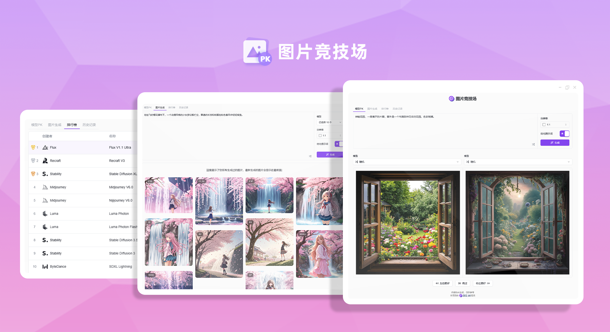
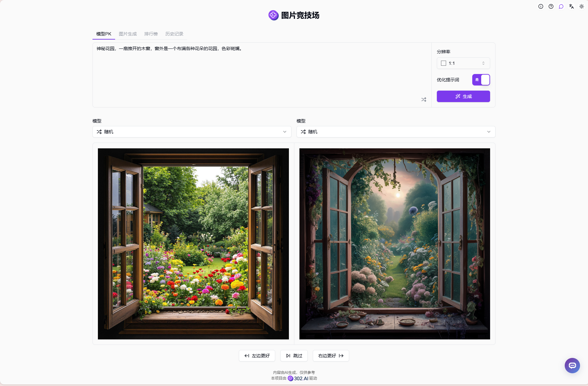
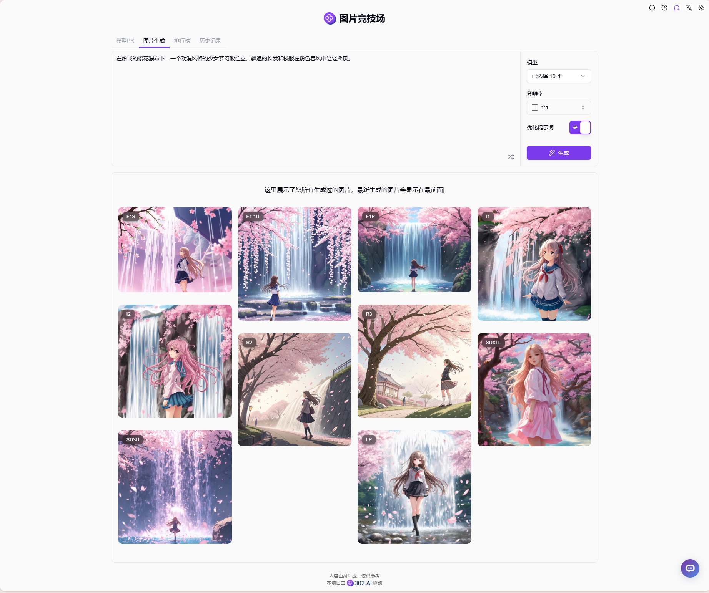
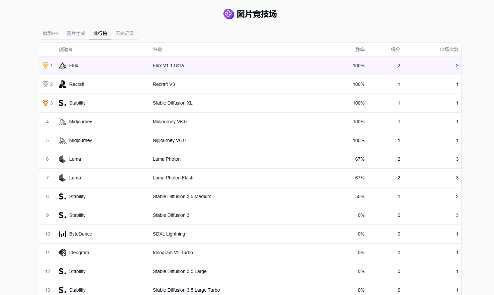
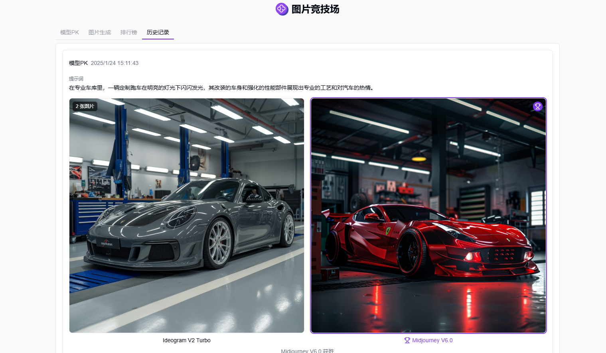

# 
 🎨 图片竞技场 🚀✨

图片竞技场可以随机或自选两个AI模型进行文生图，投票选择效果更佳的模型，根据投票结果生成个人排行榜，也可以同时选择多个AI模型生成多张图片。

<a href="README_zh.md">中文</a> | <a href="README.md">English</a> | <a href="README_ja.md">日本語</a>

来自[302.AI](https://302.ai)的[图片竞技场](https://302.ai/product/detail/57)的开源版本。你可以直接登录302.AI，零代码零配置使用在线版本。或者对本项目根据自己的需求进行修改，传入302.AI的API KEY，自行部署。

## 界面预览
在模型PK中可以随机或自选两个模型进行文生图，并投票选出效果更佳的模型。

支持多选模型同时进行文生图。可以一次性选择多个不同的模型，使用相同的提示词生成图片，快速对比不同模型的效果。

根据用户的投票结果，系统会自动生成个人模型排行榜，帮助你找到最适合的AI生图模型。

生成过的图片都可以在历史记录中找到。

## 项目特性
### 🎨 多模型支持
支持多个主流AI绘图模型，包括Stable Diffusion、Midjourney等。
### 🔄 模型对比
支持两两对比或多模型同时生成，直观对比效果。
### 📊 排行榜系统
基于用户投票生成个人模型排行榜。
### 💾 历史记录
完整保存所有生成记录和参数配置。
### 🌍 多语言支持
  - 中文界面
  - English Interface
  - 日本語インターフェース

## 🚩 未来更新计划
- [ ] 支持更多AI绘图模型
- [ ] 添加更多图片生成参数选项

## 🛠️ 技术栈
- React
- Tailwind CSS
- Shadcn UI

## 开发&部署
1. 克隆项目 `git clone https://github.com/302ai/302_image_arena`
2. 安装依赖 `npm`
3. 配置302的API KEY 参考.env.example
4. 运行项目 `npm run dev`
5. 打包部署 `docker build -t 302_image_arena . && docker run -p 3000:80 302_image_arena`
6. node版本为20及以上

## ✨ 302.AI介绍 ✨
[302.AI](https://302.ai)是一个按需付费的AI应用平台，为用户解决AI用于实践的最后一公里问题。
1. 🧠 集合了最新最全的AI能力和品牌，包括但不限于语言模型、图像模型、声音模型、视频模型。
2. 🚀 在基础模型上进行深度应用开发，我们开发真正的AI产品，而不是简单的对话机器人
3. 💰 零月费，所有功能按需付费，全面开放，做到真正的门槛低，上限高。
4. 🛠 功能强大的管理后台，面向团队和中小企业，一人管理，多人使用。
5. 🔗 所有AI能力均提供API接入，所有工具开源可自行定制（进行中）。
6. 💡 强大的开发团队，每周推出2-3个新应用，产品每日更新。有兴趣加入的开发者也欢迎联系我们
